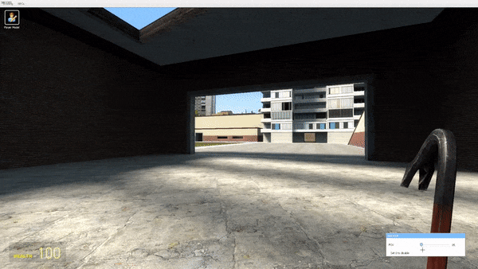

# Garry's Mod Custom FOV

Addon for Garry's Mod that allows you to change your FOV more than is normally allowed within the game.

## [Steam mod page](https://steamcommunity.com/sharedfiles/filedetails/?id=1990062880)

Open your spawmenu, go to options, Custom FOV, and click on 'Set FOV' to use it.

## Console Commands and cvars

Only client side.

| **Console Var**      | **Description**                                                                                                           |
|----------------------|---------------------------------------------------------------------------------------------------------------------------|
| cfov_enable          | Enables the mod  - **1**: Enabled (default)  - **0**: Disabled                                                      |
| cfov                 | Change the fov value  - **Min**: 70  - **Max**: 175                                                                 |
| cfov_viewmodel_fixed | Makes the viewmodel in place, as if it was in it's default value (54) - **1**: Enabled  - **0**: Disabled (default) |
